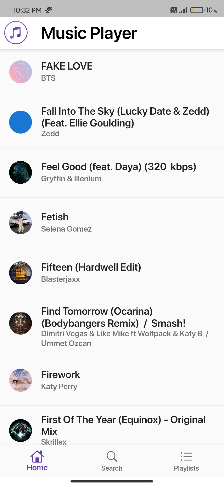
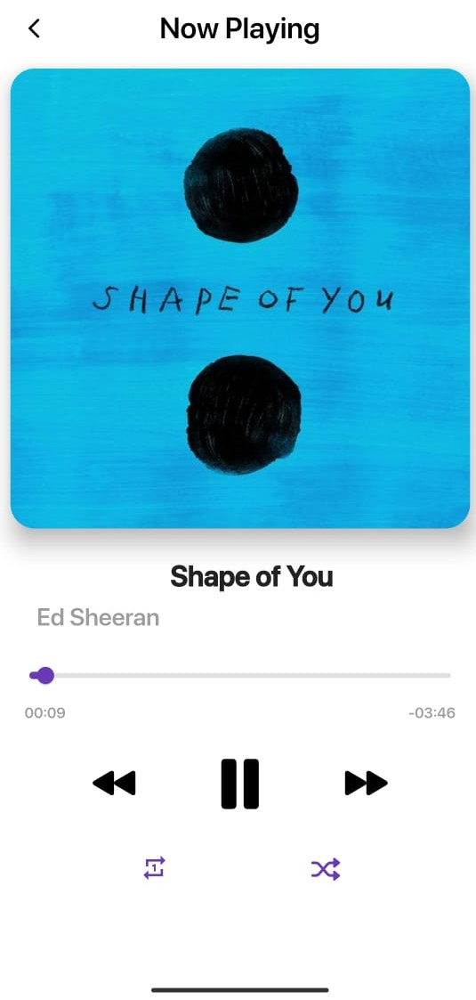
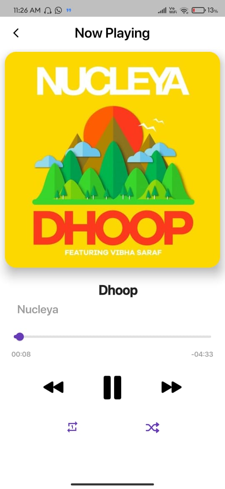
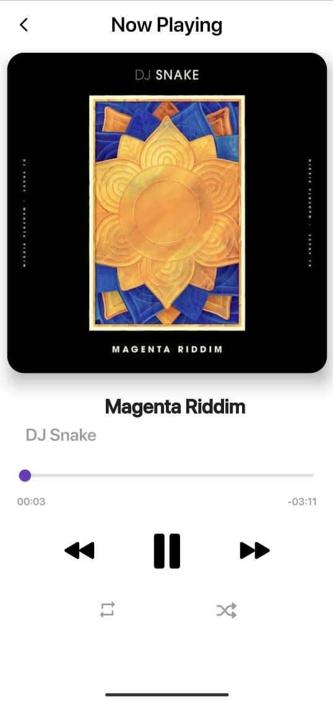

# 𝖬𝗎𝗌𝗂𝖼 𝖯𝗅𝖺𝗒𝖾𝗋 🎵

> Music Player Application for Android - Simple, Robust and Beautiful

 

:star: Star this repo on GitHub — it helps!

## Description
A simple music player application for Android made using [Flutter](https://flutter.dev/) packed with all the features to give you the best listening experience with beautiful UI. The minimalistic yet elegant UI makes the app small in size and fast in terms of performance.

## 🚩 Table of Contents

- [Packages](#-packages)
- [Screenshots](#-screenshots)
- [Features](#-features)
- [Releases](#-releases)
- [License](#-license)

## 📦 Packages Used

- [flutter_audio_query](https://pub.dev/packages/flutter_audio_query)
- [just_audio](https://pub.dev/packages/just_audio)
- [audio_service](https://pub.dev/packages/audio_service)

## 🖼️ Screenshots
    

## 🎨 Features

* Play songs from your device's local storage
* Play/Pause/Skip Tracks
* Repeat/Shuffle play your favourite songs from Library
* Seek position on current playing track
* onComplete

## Releases
* [ARM64 v8a](..\Builds\app-arm64-v8a-release.apk)
* [ARMabi v7a](..\Builds\app-armeabi-v7a-release.apk)
* [x86_64](..\Builds\app-x86_64-release.apk)

## 📜 License

This software is licensed under the [MIT](https://github.com/nhn/tui.editor/blob/master/LICENSE) © [me](https://github.com/Recker4244).